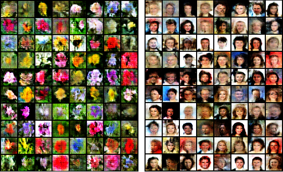

# reptile-wgan
Generate images with WGAN using a meta-learning algorithm (Reptile) to learn quickly

The first step of this project is to train a deep antagonistic generative network with the use of a scalable meta-learning algorithm ([Reptile](https://openai.com/blog/reptile/): takes in a distribution of tasks, where each task is a learning problem, and it produces a quick learner — a learner that can generalize from a small number of examples) on different datasets: each meta-learning task corresponds to a different dataset. Once you have trained this model, you can go to a classic training phase through a fine-tuning, to evaluate the performance and accuracy (WIP).



# Installation and usage
```
$ git clone https://github.com/matteodalessio/reptile-wgan.git
$ cd reptile-wgan
$ python3 main.py
```
For the different command line options:
```
$ python3 main.py --help
```
All command line option:

```
  -h, --help          show this help message and exit
  --batch_size        batch size (default=16)
  --dataset_path      dataset path
  --nz                number of dimensions for input noise
  --epochs            number of training epochs
  --cuda              enable cuda
  --save_every        after how many epochs save the model
  --save_dir          path to save the trained models
  --samples_dir       path to save the dataset samples
  --output            path to save the images generated in the test phase
  --classes           classes in base-task (n-way)
  --shots             shots per class (k-shot)
  --iterations        number of base iterations
  --test-iterations   number of test iterations
  --meta-lr           meta learning rate
  --lr                base learning rate
```
